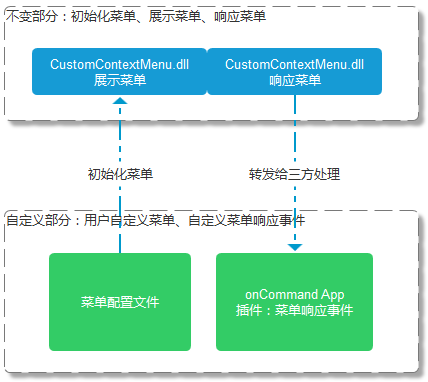
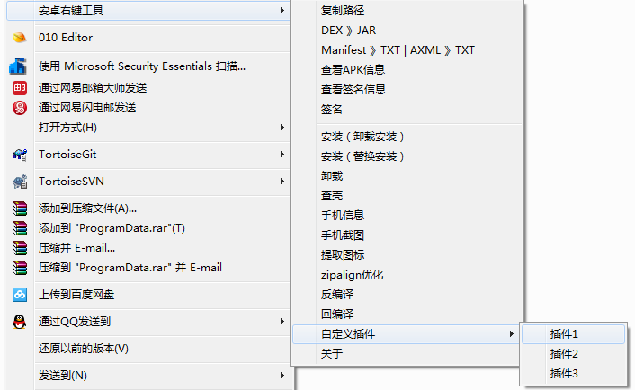

自定义系统右键菜单工具-使用说明


# 安装
**以管理员身份运行**：install.bat

# 卸载
**以管理员身份运行**：uninstall.bat，由于是重启了explorer.exe，所以卸载后dll文件可以直接删除。

# 设计模式
主要分为固定部分和可配置部分，固定部分主要是保持Windows SHELL编程的透明，使用者无须关心右键的菜单如何创建、展示和响应的。

可配置部分主要是自定义菜单和菜单的响应事件。



## 自定义菜单配置
### 菜单配置文件
在bin目录下修改menu.xml，默认给出了一个模板：
```
<?xml version="1.0"?>
<menu name="安卓右键工具" icon="icon\logo.png">
  <menu name="复制路径" icon="icon\copypath.png" tag="copypath"/>
  <menu name="DEX 》JAR" icon="icon\dex2jar.png" tag="dex2jar"/>
  <menu name="Manifest 》TXT | AXML 》TXT" icon="icon\m2txt.png" tag="axml2txt"/>
  <menu name="查看APK信息" icon="icon\apkinfo.png" tag="viewapk"/>
  <menu name="查看签名信息" icon="icon\signinfo.png" tag="viewsign"/>
  <menu name="签名" tag="sign" icon="icon\sign.png"/>
  <menu/>
  <menu name="安装（卸载安装）" icon="icon\install.png" tag="installd"/>
  <menu name="安装（替换安装）" icon="icon\installr.png" tag="installr"/>
  <menu name="卸载" icon="icon\uninstall.png" tag="uninstall"/>
  <menu name="查壳" icon="icon\detect.png" tag="viewwrapper"/>
  <menu name="手机信息" icon="icon\phone.png" tag="phone"/>
  <menu name="手机截图" icon="icon\photo.png" tag="photo"/>
  <menu name="提取图标" icon="icon\extracticon.png" tag="icon"/>
  <menu name="zipalign优化" icon="icon\align.png" tag="zipalign"/>
  <menu name="反编译" icon="icon\decom.png" tag="baksmali"/>
  <menu name="回编译" icon="icon\build.png" tag="smali"/>
  <menu name="自定义插件" icon="icon\plug.png">
    <menu name="插件1" tag="plug1"/>
    <menu name="插件2" tag="plug2"/>
    <menu name="插件3" tag="plug3"/>
  </menu>
  <menu name="关于" icon="icon\about.png" tag="about"/>
</menu>
```
### 菜单配置说明
- 一个菜单项三个属性，分别为name，icon和tag。
- 如果name为空，则该菜单项为分隔条，例如配置分隔条可以这样配置：

```
<menu/>
```

- icon指示了菜单项的图标文件，以相对路径填写，相对于dll的所在目录。例如：icon\logo.png，若不填写或者指示的图标文件不存在或者加载失败，则条菜单项前面不会出现图标，问题不大。为了加快菜单的加载速度，也可以全部不配置图标文件。
- tag：如果该项菜单没有子菜单，也不是分隔条，那么就要响应事件，则tag指示了响应的事件名称，最终会被传递到oncommand.py中。
- 如果菜单含有子菜单项，则按示例menu.xml添加即可。最多支持二级菜单项，不支持更深层次的子菜单。


## 效果截图





## 如何响应事件
点击任意菜单项后，会有弹框提示，根据提示编写相应的脚本代码即可。

用户点击菜单项时，菜单的tag名称会被传递到./plug/oncommand.py中，参数形式为：
```
oncommand.py tag file [files]
```
如果用户只选择了一个文件，则参数形式为：
```
oncommand.py tag file
```
如果用户只选择了多个文件，则参数形式为：
```
oncommand.py tag file files
```
也即出现开关files，也可以认为多了一个参数标志。当出现这个标志时，file是一个纯文本的文件全路径，内容是用户选择的多个文件列表，逐行列出。可以在py文件中自行处理多个文件的菜单响应事件，这里并没有实现。

## 注意：
- menu.xml配置文件需要utf-8格式
- 选择多文件时生成的临时文件也是utf-8格式的

