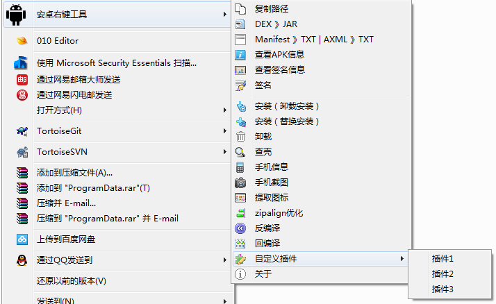
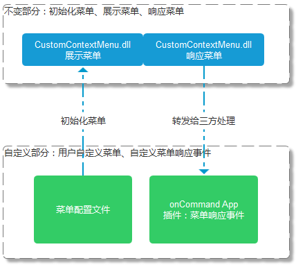
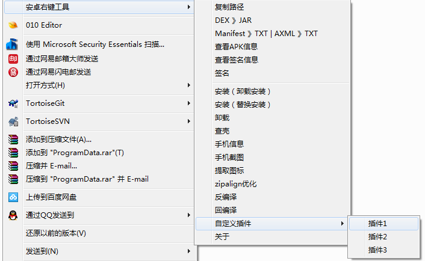

# CustomContextMenu

## 简介

CustomContextMenu 是一个 Windows 资源管理器右键菜单扩展。它把右键菜单的 Shell 扩展逻辑固定在一个轻量 DLL 中，把菜单名称、图标、子菜单和点击后执行的命令都交给 `bin/menu.xml` 配置。

适合把常用脚本、命令行工具、APK 分析工具、内部自动化工具或文件处理工具挂到资源管理器右键菜单里。使用者只需要修改 XML，不需要重新编译 DLL。



项目由两部分组成：

- `bin/CustomContextMenu.dll`：注册到系统中的 Shell COM 扩展。
- `bin/menu.xml`：菜单配置文件，定义菜单展示和点击后的执行命令。

整体设计如下：



当前实现使用纯 C 编写核心 DLL，不依赖 C++/ATL/STL。菜单 XML 使用项目内轻量解析逻辑，菜单 PNG/BMP 图标通过 Win32/GDI+ flat API 加载。

## 如何使用

### 安装和卸载

以管理员身份打开命令行，进入 `bin` 目录：

```bat
install.bat
```

卸载：

```bat
uninstall.bat
```

卸载脚本会反注册 DLL，并重启 `explorer.exe`，因此卸载后通常可以直接删除 DLL。

### 修改菜单

编辑 `bin/menu.xml`。根节点定义主菜单，子节点定义一级菜单或二级菜单。

```xml
<?xml version="1.0" encoding="utf-8"?>
<menu name="我的右键工具" icon="icon\logo.png" run="tools\handler.exe" debug="0">
  <menu name="复制路径" arg="{1}"/>
  <menu name="记事本打开" icon="icon\notepad.png" run="notepad" arg="{1}"/>
  <menu/>
  <menu name="图片工具" icon="icon\photo.png">
    <menu name="压缩图片" run="tools\image-compress.exe" arg="-i {1}"/>
    <menu name="查看目录" run="cmd" arg="/c start {path}"/>
  </menu>
</menu>
```

常用属性：

- `name`：菜单显示名称。空的 `<menu/>` 表示分隔线。
- `icon`：菜单图标路径，相对于 DLL 所在目录，例如 `icon\logo.png`。
- `run`：点击菜单后执行的程序或脚本。支持绝对路径，也支持相对 DLL 目录的路径。
- `arg`：传给 `run` 的参数。
- `debug`：根菜单属性。设置为 `1` 时会输出 `log.txt` 并在批量处理时等待当前命令结束。

`run` 支持以下类型：

- `.exe` 或系统命令：直接执行。
- `.py`：使用 `python "脚本路径"` 执行。
- `.jar`：使用 `java -jar "jar路径"` 执行。
- `.lua`：使用 DLL 同目录下的 `runLua.exe` 执行。

`arg` 支持占位符：

- `{0}`：DLL 所在目录，末尾带反斜杠。
- `{1}`：当前选中文件或目录的完整路径。
- `{path}`：当前选中项的父目录，末尾带反斜杠。
- `{name}`：当前选中项文件名，不含扩展名。
- `{ext}`：当前选中项扩展名，包含点号。

路径类占位符在常见独立参数场景下会自动加引号，能处理包含空格的路径。

### 使用场景

开发者可以把构建、格式化、反编译、签名、日志分析等命令挂到右键菜单。例如右键 `.apk` 后执行 APK 信息查看、签名检查、反编译、zipalign 或安装到设备。

测试人员可以把常用诊断动作做成菜单。例如一键抓取设备截图、导出日志、生成测试报告、打开测试数据目录。

设计或运营人员可以把文件处理动作做成菜单。例如图片压缩、批量改名、复制文件路径、把素材目录交给内部上传工具。

运维或支持人员可以把排障脚本做成菜单。例如对日志文件执行脱敏、提取错误码、打开关联工单页面或运行检测脚本。

个人用户可以把常用程序做成自己的右键工具箱。例如用指定编辑器打开、复制 Unix 风格路径、把文件移动到归档目录、打开当前目录的命令行窗口。

### 示例效果



### 配置建议

`menu.xml` 使用 UTF-8 编码保存。

优先给 `run` 写明确路径。相对路径会按 DLL 所在目录解析，适合把工具和 DLL 放在同一个 `bin` 目录下分发。

调用 `cmd /c` 时要格外注意参数引用。文件名来自用户选择的路径，建议尽量让真实处理逻辑放在 exe、py、jar、lua 中完成，减少复杂 shell 拼接。

## 技术原理

### Shell 扩展流程

DLL 注册为 Windows Shell 的 COM 右键菜单扩展。资源管理器加载 DLL 后，会通过 `IShellExtInit` 传入当前选中的文件列表，再通过 `IContextMenu` 请求 DLL 插入菜单项。

用户点击菜单项时，Shell 调用 `InvokeCommand`。DLL 根据菜单项编号找到 `menu.xml` 中配置的 `run` 和 `arg`，替换占位符，最后用 `CreateProcessW` 启动外部工具。

### 配置加载

加载顺序：

1. 优先读取 DLL 同目录下的 `menu.xml`。
2. 如果文件不存在或解析失败，使用 DLL 资源中内置的 `src/res/menu.xml`。

菜单最多支持二级子菜单。更深层级会被忽略，避免资源管理器右键菜单过深影响使用体验。

### 注册方式

默认安装脚本使用 `regsvr32 CustomContextMenu.dll /CodeBase` 调用 DLL 的 `DllRegisterServer`。注册时会写入以下位置：

```text
HKEY_CLASSES_ROOT\CLSID\{BD0E9CC2-1485-4077-99E2-49EEC6B4A618}
HKEY_CLASSES_ROOT\*\shellex\ContextMenuHandlers\CustomContextMenu{BD0E9CC2-1485-4077-99E2-49EEC6B4A618}
HKEY_CLASSES_ROOT\Directory\shellex\ContextMenuHandlers\CustomContextMenu{BD0E9CC2-1485-4077-99E2-49EEC6B4A618}
```

`doc/refer/add_menu.reg` 展示了另一种不写 Shell 扩展 DLL 的手动注册方式：直接在 `HKEY_CLASSES_ROOT\*\shell\...` 下创建普通右键菜单项，并在每个 `command` 子键中写死要执行的命令，例如：

```reg
[HKEY_CLASSES_ROOT\*\shell\myRightClick\shell\submenu02\command]
@="py -3 F:\\tools\\verifyApkSign.py \"%1\""
```

这种方式简单、透明，适合少量固定菜单；缺点是菜单内容都写在注册表里，不方便按 XML 集中维护，也不适合复杂的动态菜单。`doc/refer/delete_menu.reg` 则用于删除该示例注册表分支。

